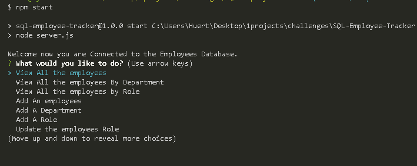

# SQL-Employee-Tracker

<br />

 <br />

## Table of Contents 

- [Description](#description)
- [Installation](#installation)
- [Usage](#usage)
- [Screenshots](#screenshots)
- [Demos](#demos)
- [Deployed](#deployedapplicationlink)
- [Languages](#languages)
- [License](#license)
- [Questions](#questions)

<br />
<br />

## Description

A command-line application to manage a company's employee database, using Node, Inquirer, and MySQL.
. <br />

## Installation
Clone the repository from GitHub:
```
git clone git@github.com:Tonycodesnow/SQL-Employee-Tracker.git
```
Make sure you have a working Node.js installation.
```
To install all the dependencies, use the command below:
```
npm i
```
Make sure you have a working MySQL installation with a legitimate username and password.
```

<br />

## Usage

This application can help you keep track of employees and their info within the company. <br />

To run the application, use the command below:
```
npm start
```
## Screenshots

What the command line interface looks like:


<p align="center"></p> <br /> 

## Demos

Click on the link below for a video demonstration of the application and the generated index.html file at the end:

https://watch.screencastify.com/v/D3H1c4cXKI6kOcv53z6T

## Deployed application link

https://github.com/Tonycodesnow/SQL-Employee-Tracker  <br />

## Languages

JavaScript, Google Fonts, Material Icons, Node, Inquirer, mysql <br />


## License

  This project is licensed under the MIT license. <br />

  <br />

## Questions?

If you have any questions, contact me at: 
tony.huertinez@gmail.com  <br />
Check out my other work at GitHUb:
[antoniohuerta](https://github.com/Tonycodesnow) <br />
